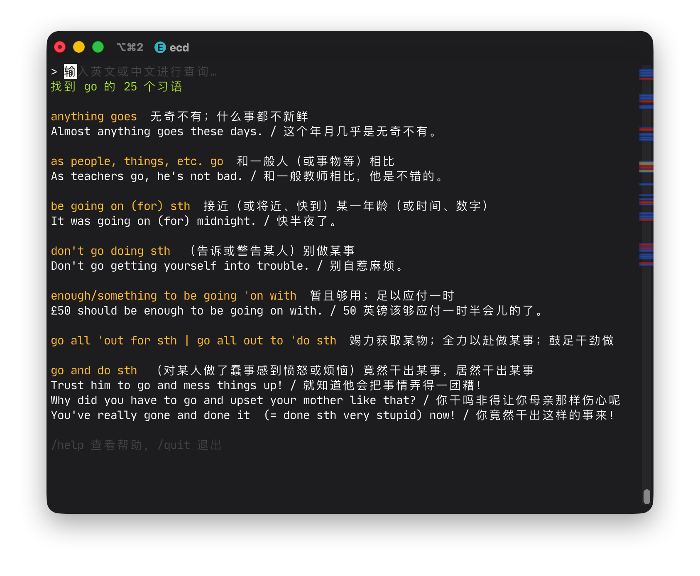
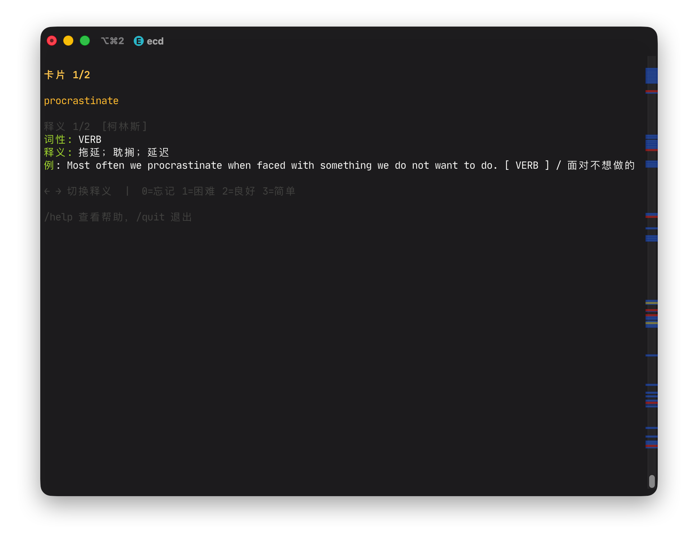

# ecd


ecd 是一个在命令行中运行的英汉词典。

## 功能

- 日常词典数据呈现，支持英文精确匹配、前缀匹配和模糊匹配，支持中文反查（根据释义和例句搜索），支持随机抽词。
- 同义词、反义词查找。该功能基于词典数据，仅支持查找有记录的同义词或反义词，一些较为显然的词语例如 _good_ 和 _bad_ 之间可能并未记录反义关系。
  
- 习语查找。
  
- 记忆卡片。可将单词加入到卡片组中，定期复习，帮助记忆。该部分设计基于 SM-2 算法。
  

## 开始使用

1. 从最新构建中下载二进制文件，复制到本地某个位置
2. 获取词汇数据库 `ecd.db`（约 114MB），并放置在与二进制文件同目录下（也可以是不同目录，详见配置文件）

> [!NOTE]
> 词汇数据库可通过解压下载下来的 `ecd.db` 得到
>
> ```sh
> xz -d ecd.db.xz
> ```

## 构建

构建需要 Go 版本 1.25+

```sh
git clone https://github.com/Subilan/ecd.git
cd ecd
make build
xz -d ecd.db.xz
./ecd
```

## 指令格式

推荐在使用之前为脚本加上别名以便快速调用。一些常用的指令格式如下：

```sh
# 精确
ecd hello
# 前缀
ecd surprisingl
# 模糊
ecd rondevus

# 指定词典
ecd -s collins beauty
ecd -s oxford beauty

# 中文反查
ecd 全面的

# 随机单词
ecd -r
ecd -r -s oxford

# 禁用 ANSI 颜色输出
ecd --no-color hello

# 进入交互模式
ecd
```

## 交互模式

不带任何参数执行 ecd 可以进入交互模式，体验完整功能。交互模式下支持以下命令：

| 命令                        | 说明                                                  |
| --------------------------- | ----------------------------------------------------- |
| `/add [word]`               | 将指定单词（或最近查询的单词）加入记忆卡片组          |
| `/del <word>`               | 从卡片组中移除指定单词                                |
| `/auto-add [on\|off]`       | 开启/关闭查词后自动加入卡片组。不带参数则切换开关状态 |
| `/review`                   | 复习到期的记忆卡片                                    |
| `/deck`                     | 查看卡片组统计                                        |
| `/reset`                    | 清空所有卡片数据                                      |
| `/syn [word]`               | 查询同义词                                            |
| `/ant [word]`               | 查询反义词                                            |
| `/idm [word]`               | 查询习语                                              |
| `/lang [en\|zh]`            | 切换界面语言（只支持中文或英文）                      |
| `/random`                   | 随机显示一个单词                                      |
| `/help`                     | 显示帮助信息                                          |
| `/exit` `/quit` `/q` Ctrl+C | 退出                                                  |
| Esc                         | 清空输入框获返回搜索界面                              |
| Tab                         | 切换页面滚动，用于浏览上下溢出的搜索结果              |

## 记忆卡片

ecd 内置了基于 SM-2 算法的间隔重复记忆功能，适合结合查词过程积累生词。

- 查完一个单词后，输入 `/add` 即可将其加入卡片组。也可以直接 `/add <单词>` 添加任意单词。
- 使用 `/auto-add on` 开启自动添加，之后每次查词自动加入卡片组。
- 使用 `/del <单词>` 可从卡片组中移除指定单词。
- 使用 `/reset` 可清空所有卡片数据重新开始（需二次确认）。
- 输入 `/deck` 查看卡片组统计，包括总数、到期数、新卡片、成熟卡片、最近复习时间、水蛭卡（ease ≤ 1.3 的难记词）及平均简易度。
- 输入 `/review` 开始复习。每张卡片先显示单词和发音，由此思考自己是否记住了该单词；按回车后显示释义、例句等，最后选择评分：
    - `0` Again — 完全忘记
    - `1` Hard — 勉强想起
    - `2` Good — 正常想起
    - `3` Easy — 轻松想起

## 配置文件

ecd 使用 TOML 格式的配置文件。默认读取当前目录下的 `ecd.toml`，也可以通过 `--config` 参数指定路径：

```sh
ecd --config /path/to/ecd.toml hello
```

配置文件示例：

```toml
# 词典数据库路径（默认为当前目录下的 ecd.db）
db_path = "/path/to/ecd.db"

# 查词历史与记忆卡片数据库路径（默认为 ~/.ecd_lookup.db）
lookup_db = "~/.ecd_lookup.db"
```

| 字段        | 说明           | 默认值               |
| ----------- | -------------- | -------------------- |
| `db_path`   | 词典数据库路径 | `ecd.db`（当前目录） |
| `lookup_db` | 用户数据库路径 | `~/.ecd_lookup.db`   |

若配置文件不存在，程序将使用默认值运行。

## AI References

This project provides comprehensive instructions and documentations for models to facilitate coding with agents:

- `README.md`
- `CLAUDE.md`
- `cli/docs`
- `extract/docs`

## 协议

MIT

注：词典内容受版权保护，仅供个人学习使用。