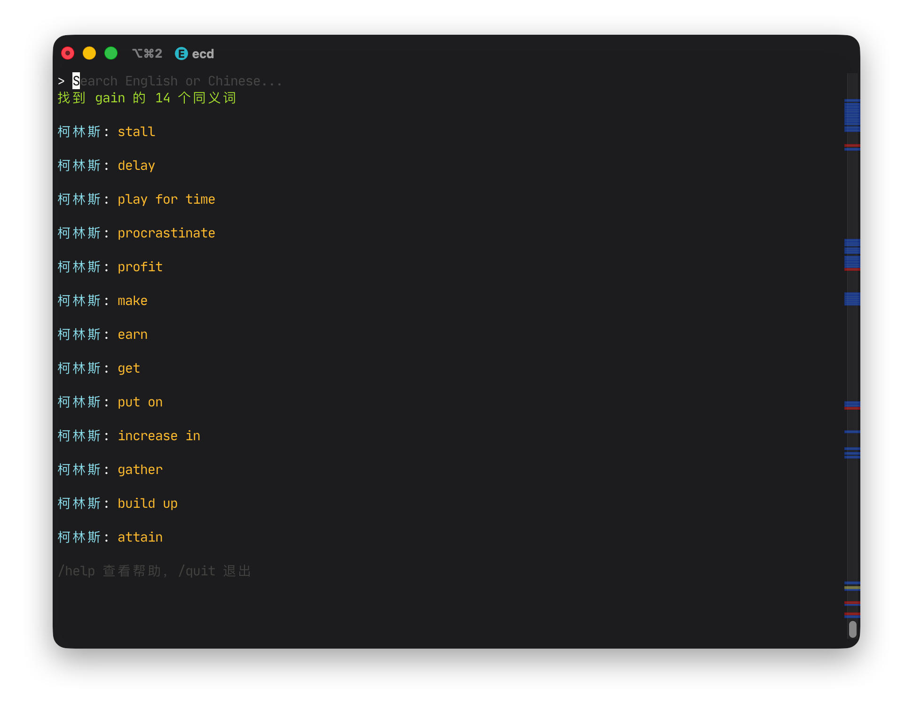
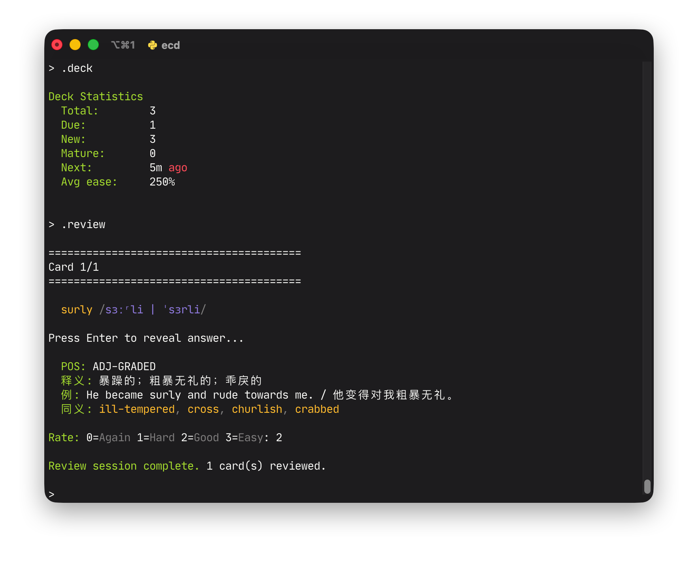

# ecd

ecd 是一个在命令行中运行的英汉词典。


## 功能

- 日常词典数据呈现，支持英文精确匹配、前缀匹配和模糊匹配，支持中文反查（根据释义和例句搜索），支持随机抽词。
- 同义词、反义词查找。该功能基于词典数据，仅支持查找有记录的同义词或反义词，一些较为显然的词语例如 *good* 和 *bad* 之间可能并未记录反义关系。

- 记忆卡片。可将单词加入到卡片组中，定期复习，帮助记忆。该部分设计基于 SM-2 算法。


## 依赖

- Python 3.11+
- 本地的词汇数据库 `ecd.db`（约 114MB），可通过解压 `ecd.db.xz` 得到
    ```sh
    xz -d ecd.db.xz
    ```

## 开始使用

```sh
git clone https://github.com/Subilan/ecd.git
cd ecd
xz -d ecd.db.xz
chmod +x ./ecd
./ecd
```

## 指令格式

推荐在使用之前为脚本加上别名以便快速调用。

```sh
# 精确
ecd hello
# 前缀
ecd surprisingl
# 模糊
ecd rondevus

# 指定词典
ecd -s collins beauty
ecd -s oxford beauty

# 中文反查
ecd 全面的

# 随机单词
ecd -r
ecd -r -s oxford

# 禁用 ANSI 颜色输出
ecd --no-color hello

# 进入交互模式
ecd
```

## 交互模式

不带任何参数执行 ecd 可以进入交互模式，体验完整功能。交互模式下支持以下命令：

| 命令 | 说明 |
|------|------|
| `.add [word]` | 将指定单词（或最近查询的单词）加入记忆卡片组。添加前会查词典预览 |
| `.auto-add [on\|off]` | 开启/关闭查词后自动加入卡片组 |
| `.review` | 复习到期的记忆卡片 |
| `.deck` | 查看卡片组统计 |
| `.reset` | 清空所有卡片数据 |
| `.syn [word]` | 查询同义词 |
| `.ant [word]` | 查询反义词 |
| `.random` | 随机显示一个单词 |
| `.help` | 显示帮助信息 |
| `.exit` `.quit` `.q` Ctrl+C Ctrl+D | 退出 |

## 记忆卡片

ecd 内置了基于 SM-2 算法的间隔重复记忆功能，适合结合查词过程积累生词。

- 查完一个单词后，输入 `.add` 即可将其加入卡片组。也可以直接 `.add <单词>` 添加任意单词，添加前会自动查词典预览释义。
- 使用 `.auto-add on` 开启自动添加，之后每次查词自动加入卡片组。
- 使用 `.reset` 可清空所有卡片数据重新开始。
- 输入 `.deck` 查看卡片组统计，包括总数、到期数、新卡片、成熟卡片（间隔 ≥ 21 天）、最近复习时间、水蛭卡（ease ≤ 1.3 的难记词）及平均难易度。
- 输入 `.review` 开始复习。每张卡片先显示单词和发音，由此思考自己是否记住了该单词；按回车后显示释义、例句等，最后选择评分：
  - `0` Again — 完全忘记
  - `1` Hard — 勉强想起
  - `2` Good — 正常想起
  - `3` Easy — 轻松想起

## AI References

本项目使用 Claude Code 搭配深度求索 DeepSeek v4 Pro 模型计划和编写。模型参考文件：
- README.md
- CLAUDE.md
- extract/extract-plan.md

## 协议

MIT

注：词典内容受版权保护，仅供个人学习使用